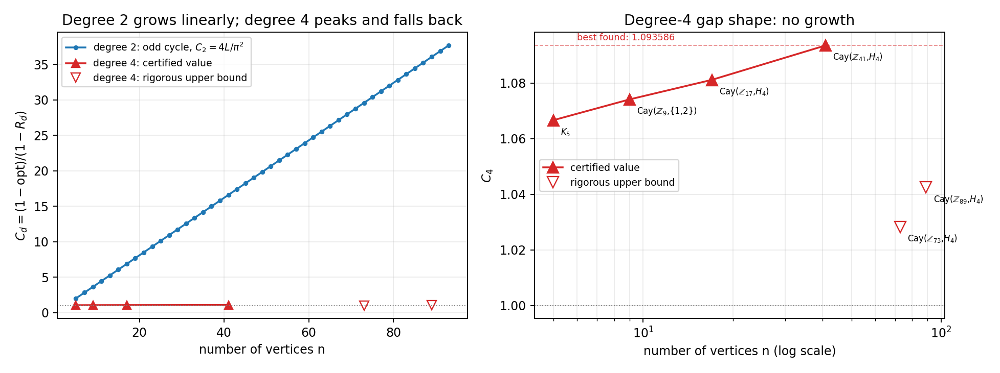

# Measuring the Gap Shape of Sum-of-Squares Relaxations of Unique Games

[](https://opensource.org/licenses/MIT)

A three-day computational investigation, by one person on one laptop, of a single scalar derived from
a stated open question about Khot's Unique Games Conjecture. Every value reported here comes from a
direct evaluation, a machine-checkable certificate, or an exhaustive enumeration.

**The outcome is negative, and it was anticipated.** Across every family searched, the largest
degree-4 gap shape found is 1.093586, and degree-4 sum-of-squares turned out to be exact, or within a
few per cent of exact, nearly everywhere it was measured. The plan written before the search
([docs/PLAN.md](docs/PLAN.md)) named this outcome in advance and pre-committed the response: publish
the negative map and the tool. That is what this repository is.

## Scope

No progress is made on the conjecture. There is no new hardness result, no new algorithm, and no new
lower bound. What is here, stated at its actual size:

* **An elementary reformulation** turning the Khot–Moshkovitz question into a single supremum, and an
  **elementary inequality** that makes a finite search *complete* rather than merely extensive. Both
  are one-line arguments. The second is what lets a sweep report absence rather than failure to find.
* **Certified solvers**: degree-4 sum-of-squares by ADMM with two-sided bounds, symmetry-reduced for
  cyclic groups and for arbitrary finite groups through numerically computed irreducible
  representations, plus a certified alternating LP/sum-of-squares ascent over instance weights. This
  is the most reusable part of the repository.
* **A measurement** of the gap shape over several hundred certified instances (374 circulants, 127
  non-abelian Cayley graphs, 144 targeted circulants, the exhaustive n ≤ 6 census, and the sparse,
  Paley and hypercube families), and the null result above.
* **A construction framework** for non-abelian unique games that reproduces Khot–Vishnoi as the
  abelian case. Its novelty has not been checked against the literature.
* **Two proved theorems**, both negative: degree-4 sum-of-squares is strictly weaker than degree 2
  on the Paley graphs at p = 13 and 17, by exact integer certificates with no floating point in the
  verification.
* **A record of corrections.** One claim was made during the work and refuted by its own follow-up.
  Two findings survived verification but, on a literature check, turned out to be already known or
  already predicted. One prediction was pre-registered, confirmed once, and then refuted twice. All
  of them are kept in the record with their corrections, because a repository that keeps only what
  survived is not a record.

Section 10 of [docs/FINDINGS.md](docs/FINDINGS.md) states what is and is not established.

## The question, made computational

Khot and Moshkovitz (ECCC TR14-142) write that no (1−ε, 1−C·ε) Lasserre integrality gap for Boolean
2Lin with C → ∞ is known, at any constant degree. Define the **gap shape** of an instance,

  C_d(I) = (1 − opt(I)) / (1 − R_d(I)),

for a degree-d relaxation R_d. Diluting an instance with a perfectly satisfiable part leaves C_d
unchanged, because both the optimum and the relaxation are affine across a disjoint union. So a gap
ratio found at *any* completeness transports to completeness 1−ε for *every* ε, and their question is
exactly

  **a (1−ε, 1−C·ε) degree-d gap with C → ∞ exists  ⟺  sup_I C_d(I) = ∞.**

At degree 2 the supremum is infinite: odd cycles give C_2 = 4L/π². At degree 4 it is open, and nothing
below changes that.

## What was found

Status vocabulary: *elementary* — a one-line argument; *measurement* — a certified number, true of the
instances measured and claiming nothing beyond them; *known* — correct here, and already in the
literature; *predicted* — the asymptotic statement was already known, the exact finite-size form
measured here was not; *unchecked* — not compared against the literature; *retracted* — wrong, kept
with its correction.

| Result | Evidence | Status |
|---|---|---|
| **The dilution identity**, turning the Khot–Moshkovitz question into sup_I C_d(I) = ∞ | one line, checked numerically | elementary |
| **C₄ ≤ C₂**, so C₄ ≤ (1 − any exhibited cut)/(1 − SoS₂) | SoS₄ ≤ SoS₂; SoS₂ is closed-form for a circulant | elementary, and the reason the sweeps below are complete |
| **No degree-4 gap shape above 1.093586 anywhere searched** | every family below, with certificates | measurement — the main result, and it is negative |
| Largest found: **1.093586** at the Cayley graph of the quartic residues mod 41 | tight certificate (lower = upper = 0.727904) and a proved optimum (0.702439) | measurement |
| The family peaks there: p = 73, 89, 97 are **ruled out** | upper bounds 1.043453, 1.074587, 1.056552 from the filter alone | measurement, exact |
| It is the subgroup **index**, not the graph degree | index 6 at p = 37 gives C₄ = 1.000000 with a closed certificate, at a degree between the two index-4 winners | measurement |
| Classical families give nothing | cycles, Petersen, Paley, sparse random regular, hypercube all give C₄ = 1 | measurement |
| Exhaustive over all instance shapes on ≤ 6 vertices | 11 and 34 switching classes, every one weight-optimised | measurement, exhaustive |
| **Complete sweep of the small circulants** | all 374 instances with L odd ≤ 19 and ≤ 3 connection classes: 16 ruled out by the filter, 358 certified, 9 stragglers settled at 250,000 iterations; maximum 1.081179 | measurement, complete — no gaps |
| **Degree 4 is exact on every sparse graph tested** | random cubic n = 12–32 (girth up to 5, C₂ up to 1.90), the McGee cage, random d-regular d = 4, 6, …, 18 at n = 24 | measurement |
| The record is **locally optimal**: a certified alternating LP/SoS ascent over all 40 class-sign weights of Z₄₁ finds no improvement | stationary point; kicks fail; re-certified 1.093586 | measurement |
| **A group-theoretic generalisation of Khot–Vishnoi** | for any finite group, normal subgroup and symmetric measure, the maximum-weight transversal problem is a unique game whose label-extended graph is a Cayley graph; Khot–Vishnoi is the abelian case, reproduced vertex for vertex | construction — **novelty unchecked** |
| **Exact basic-SDP values of the Khot–Vishnoi game** | a GL(k,2)-invariant linear program: 0.6157095, 0.3948238 (k=3), 0.7950017 (k=4), each confirmed by an independent certified numerical solve | measurement, exact |
| Consistent with the Agarwal–Kindler–Kolla–Trevisan hypercube conjecture | at dimensions 4 and 5 the degree-4 value equals the optimum, sandwiching the triangle-inequality SDP to exactness | measurement at d ≤ 5 only — 32 vertices, weak evidence |
| **On Paley graphs SoS₄ = SoS₂ = ½ + (1+√p)/(2(p−1))** for p = 29, 37, 41, 53, 61 | certified lower bounds equal to the closed form to 1e-9, upper bounds within 6e-8 (1.6e-5 at p = 61); p = 13, 17 lose the gap | **predicted**: Mohanty–Raghavendra–Xu imply this asymptotically (`mrx_check.py`). The exact finite-p equality and its threshold are not implied by their lift |
| K_n: degree 4 adds nothing to degree 2, SoS₄ = SoS₂ = n/(2(n−1)) for odd n | our solver, and Laurent's explicit certificate reproducing it to 2e-16 (`laurent_kn.py`) | **known**: a corollary of Laurent 2003, whose result covers every degree up to n−1 |
| **SoS₄ < SoS₂ on the Paley graphs at p = 13 and 17** | exact integer dual certificates: orbit sums exactly zero, all Bareiss minors positive, sign decided in integers | **proved** (section 13.2) |
| **The Paley extension is a rigid bilinear object**: the question reduces to one feasibility SDP, and where an extension exists it is a single psd form on Sym²(E_min) correcting the Wick lift | rank M_even = (p−1)(p−7)/8 at p = 29, 37, 41, 53, 61; ker = 2m; block dimensions closed form, verified for 15 primes | measurement, 5 of 5 (section 13) |
| At p = 29 the extension is **unique**, and lives in Q(√p, ζ₍ₚ₋₁₎⁄₄) rather than Q(√p) | block data rational with denominator 3p, so the eigenvalues are a DFT of rationals | measurement (section 13.5) |
| The family of extensions grows: 0, 2, 3, 7, 11 at p = 29, 37, 41, 53, 61 | Gram gaps of eight to eleven orders of magnitude | measurement; **no formula fits**, and a pre-registered one was refuted |
| A claimed growth rate | C₄ ≈ 1.046 + 0.0127·ln n at R² 0.998 on four points, killed by p = 73 and p = 89 | **retracted**, kept in the record |

## Figure



Degree 2 grows linearly in the number of vertices. Degree 4, over the same range, moves by 2.5 per cent
and then falls back. Hollow markers are rigorous upper bounds. Whether the red curve is bounded is the
open question, and this figure does not answer it: a bounded supremum would mean degree-4
sum-of-squares beats Goemans–Williamson and the Unique Games Conjecture is false, but a flat curve to
41 vertices cannot distinguish a bounded supremum from a slowly growing one.

## Installation

Python 3.9 or later. An NVIDIA GPU is optional and used only by the scalable solvers.

```bash
python -m pip install -r requirements.txt
```

## Usage

All commands run from `experiments/`.

```bash
python reproduce.py                    # recompute every published number: 120 checks, 0 mismatches
```

Self-tests of the machinery:

```bash
python ug_core.py                      # instances, exact solvers, label-extended graph
python ug_sdp.py                       # basic SDP: cvxpy vs GPU block ascent vs dual certificate
python ug_sos.py                       # level-2 Lasserre and degree-2/4 sum-of-squares
python sos_gpu.py                      # ADMM degree-4 with certified bounds
python circulant_sos.py --selftest     # symmetry-reduced degree-4 vs the dense spectrum
python kv_transversal.py --selftest     # Khot–Vishnoi as a maximum-weight transversal
python group_ug.py                     # the group framework, reproducing Khot–Vishnoi
```

The searches:

```bash
python sweep.py --Lmin 5 --Lmax 25             # stage 1: the cheap complete filter
python sweep2.py --Lmin 5 --Lmax 19            # stage 2: certified degree 4 on the shortlist
python c4_max.py --n 6 --degree 4              # exhaustive over instance shapes
python paley_index.py --jobs 17:4,41:4         # the generalised Paley family
python kv_invariant_sdp.py                     # exact Khot–Vishnoi SDP values
python hypercube_track.py --dims 4,5           # the hypercube conjecture
```

Day 3, the algorithmic tools (all certified; see FINDINGS section 11):

```bash
python weight_ascent.py --n 7 8 9              # learn the best gap shape on n vertices (LP/SoS ascent)
python class_ascent.py --L 41 --seed_gens 1 4 10 16 18   # the same over all class weights of Z_41
python kn_gap.py 21                            # C_4(K_n) for n = 5..21
python paley_lift.py 13 17 29 37 41            # SoS_4 = SoS_2 on Paley graphs, two-sided certificates
python paley_ansatz.py 29 37                   # is the extension a Legendre-pattern function? (no)
python expander_gap.py --n 16 24 --d 3         # random regular graphs: degree 2 vs degree 4
python group_sweep.py --max_order 60 --min_dim 3   # non-abelian sweep, batched, routed by carrier irrep
python hypercontract.py group                  # 2->4 norm of the carrier eigenspace vs retention
```

The prior-art checks, which is how two of the findings above were reclassified:

```bash
python mrx_check.py                            # what the MRX lift already predicts on Paley, and what it cannot
python laurent_kn.py                           # Laurent's 2003 certificate for K_n, checked against our solver
```

Day 4, the structure of the Paley extension (see FINDINGS section 13):

```bash
python paley_exact.py --validate 29            # the reduction, checked against the ADMM solution
python paley_exact.py 13 17 29                 # decide each p by one feasibility SDP
python paley_certify.py 13 17                  # EXACT integer proofs that no extension exists
python paley_rigid.py 29                       # t* = 0 is rigidity; is the extension unique?
python paley_bilinear.py 29                    # is the extension bilinear? (yes)
python paley_form.py 29                        # the single psd form Q, and its spectrum
python paley_blocks.py 29                      # Q by frequency class; the rational block data
python paley_circulant_block.py 29             # the zero-frequency circulant -> the cyclotomic field
python paley_blockdims.py 150                  # the closed-form block dimensions, 15 primes
python paley_big.py 53 61                      # rank and family dimension without dense matrices
python paley_family.py 41                      # where the freedom lives (not in one block)
```

## Repository layout

```
.
├── README.md
├── LICENSE                         # MIT
├── requirements.txt
├── docs/
│   ├── FINDINGS.md                 # the scientific record, including the corrections
│   ├── PLAN.md                     # tracks, the pre-stated failure criteria, and the barriers not worth re-running
│   ├── HYPOTHESES.md               # numbered hypotheses, each with a decisive test and its verdict
│   ├── LOG.md                      # chronological log
│   └── literature/                 # the survey, written from primary sources
├── experiments/                    # all code; every module has a self-test
├── results/                        # every instance record, certificate and solver log
├── figures/
└── tools/
```

## Reproducibility notes

- `experiments/reproduce.py` reports **120 checks, 0 mismatches** in 1368 s on an idle machine with a
  GPU. It recomputes each quantity rather than reading it from a result file.
- Every gap shape reported as a value comes from a *tight* certificate, meaning the certified lower and
  upper bounds on the relaxation agree to the printed precision, together with a proved optimum. Where
  either is missing the number is reported as an interval and labelled as such.
- Certificates bound the relaxation, not the search. A sweep is complete only in the sense of section 2
  of FINDINGS: over the instance family enumerated, and no further.
- The source PDFs behind `docs/literature/` are copyrighted and are deliberately not redistributed. Each
  is cited by title, venue and a stable link; `tools/pdf2txt.py` is the extractor used.
- Two solver behaviours worth recording: the dense degree-4 certificates go loose past about 500 rows,
  and Clarabel allocates a dense Hessian for the positive-semidefinite cone that needs 8 GB at 300 rows,
  so it is used only for small calibration instances.
- Some solver logs in `results/` contain tracebacks from bugs that were found and fixed during the work.
  They are kept deliberately.

## Citation

```bibtex
@misc{zaru2026uniquegames,
  title={Measuring the Gap Shape of Sum-of-Squares Relaxations of Unique Games:
         A Certified Null Result, a Completeness Filter, and a Group-Theoretic
         Generalisation of the Khot-Vishnoi Instance},
  author={Zaru, Nadim F.},
  year={2026}
}
```

## Prior work used

- S. Khot and N. Vishnoi, *The Unique Games Conjecture, integrality gap for cut problems and
  embeddability of negative type metrics into ℓ₁*, JACM 62(1), 2015 — the instance, reproduced and
  generalised here.
- S. Khot and D. Moshkovitz, *Candidate Lasserre Integrality Gap for Unique Games*, ECCC TR14-142 — the
  open question this repository measures.
- B. Barak, F. Brandão, A. Harrow, J. Kelner, D. Steurer and Y. Zhou, *Hypercontractivity, sum-of-squares
  proofs, and their applications*, STOC 2012 — the levels at which the known gap instances are certified.
- M. Bafna and D. Minzer, *Solving unique games over globally hypercontractive graphs*, CCC 2024 — the
  statement that graphs without certified hypercontractivity are where hardness must live.
- N. Agarwal, G. Kindler, A. Kolla and L. Trevisan, *Unique Games on the Hypercube*, CJTCS 2015 — the
  conjecture tested in section 7.
- S. Mohanty, P. Raghavendra and J. Xu, *Lifting sum-of-squares lower bounds: degree-2 to degree-4*,
  STOC 2020 — the lifting theorem that already implies the Paley behaviour of section 11.2
  asymptotically.
- D. Kunisky and A. Bandeira, *A tight degree 4 sum-of-squares lower bound for the Sherrington–Kirkpatrick
  Hamiltonian*, Math. Prog. 2021 — the random analogue of the Paley phenomenon.
- D. Kunisky and X. Yu, *A degree 4 sum-of-squares lower bound for the clique number of the Paley graph*,
  CCC 2023 — the same graph at the same degree, for a different objective.
- C. de Boor, *In Search of Degree-4 Sum-of-Squares Lower Bounds for MaxCut*, CMU-CS-19-118, 2019 —
  the analytic attack on the sparse regime measured in section 11.3.
- M. Laurent, *Lower bound for the number of iterations in semidefinite hierarchies for the cut
  polytope*, Math. Oper. Res. 28(4), 2003 — subsumes the complete-graph identity of section 11.1, at
  every degree up to n−1 rather than only 4.
- D. Grigoriev, *Complexity of Positivstellensatz proofs for the knapsack*, Comput. Complexity 10, 2001
  — the parity refutation underlying that result.

Full bibliographies are in `docs/literature/`.

## Author

**Nadim F. Zaru**
Independent Researcher

## License

MIT License, see [LICENSE](LICENSE).
